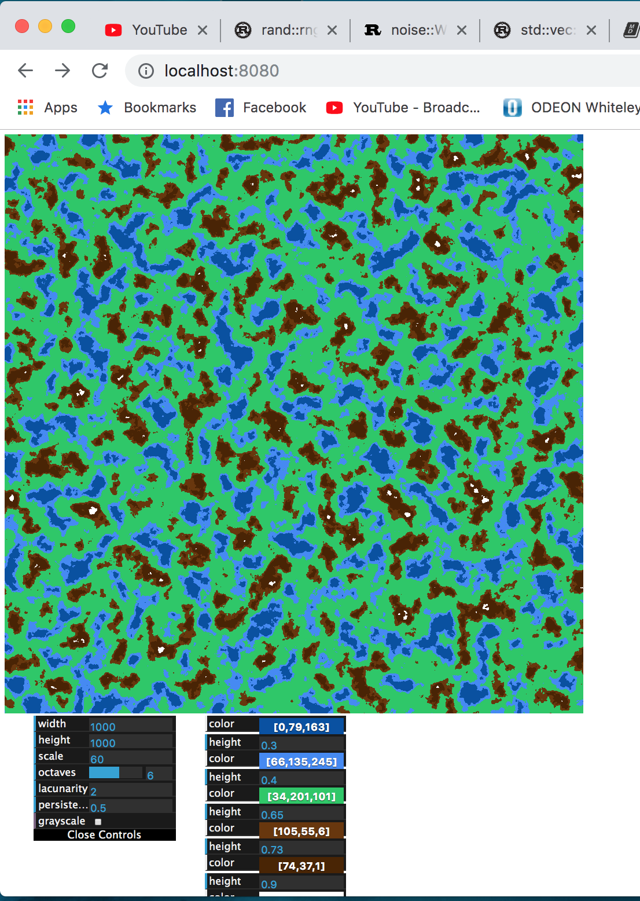
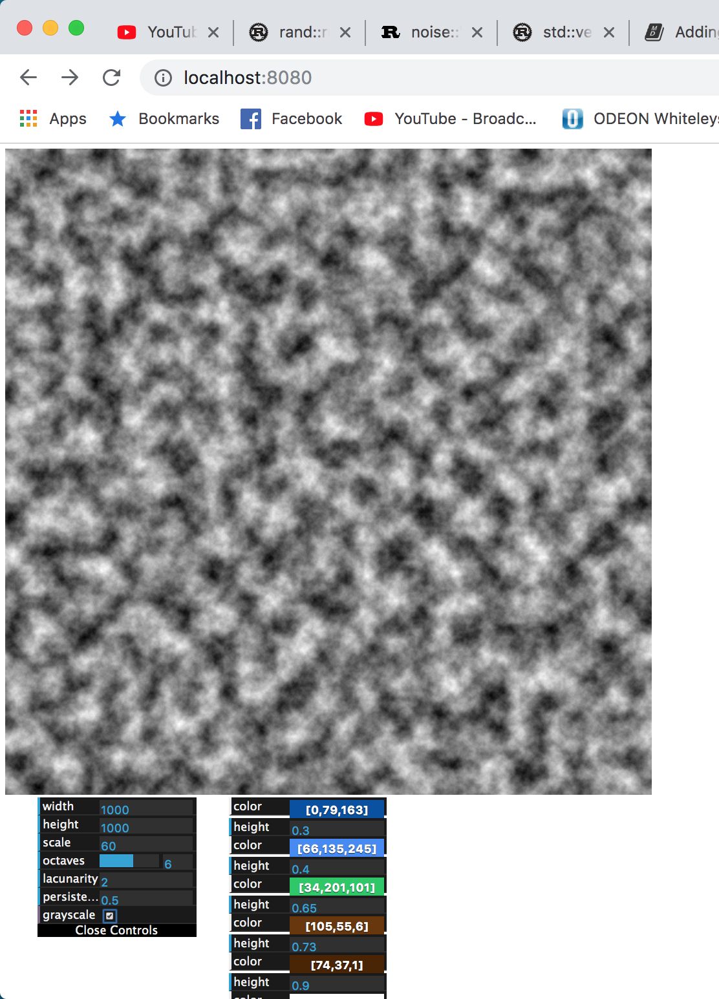

# Rust/WASM Procedural Map Generator

Uses Perlin noise to procedurally generate a height map. Built with Rust and wasm.

### Build

To build the Rust code, run `wasm-pack build`.

To run the Javascript frontend, enter the `www` directory and execute `npm run start`. This will start a development server which will automatically rebuild on save.

